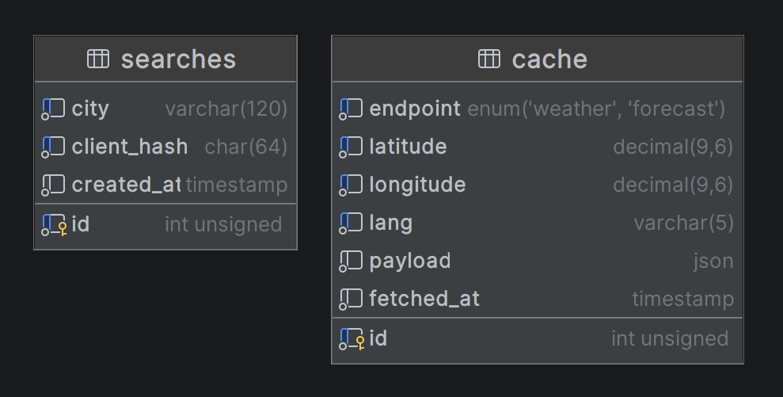

# Weather

  
  
  
  
  
  

Projeto de consulta de clima atual e previsão dos próximos dias com frontend em Vue 3 e Vite e backend em PHP, para o banco de dados foi utilizado o MySQL, foi utilizado a [API da OpenWeatherMap](https://openweathermap.org/api) para obter os dados de clima e todo o ambiente é executado com Docker.

# Funcionalidades
- Clima atual e previsão dos próximos 5 dias.
- Localização automática ao abrir o site (se permitido pelo usuário).
- Busca de cidades pelo nome com sugestões enquanto digita.
- Ranking das cidades mais buscadas.
- Cache das respostas de clima para acelerar buscas repetidas e economizar chamadas a [API da OpenWeatherMap](https://home.openweathermap.org/api_keys).
- Suporte a idiomas com [i18n](https://vue-i18n.intlify.dev/) (português e inglês já configurados).
- Ícones de clima animados com [Meteocons](https://meteocons.com/).
- Animações na interface inspiradas no [Kinetics](https://kinetics.colorion.co/).
- Layout responsivo adaptado para desktop e celular.

# Requisitos
- Faça a instalação da [Docker](https://docs.docker.com/get-docker/).
- Gere a chave de [API da OpenWeatherMap](https://home.openweathermap.org/api_keys).

# Configurações
Clone o repositório e crie o arquivo .env com base no exemplo [.env.example](https://github.com/Vinicius-CS/weather/blob/main/.env.example).
- `cp .env.example .env`
	- **Configure as seguintes variáveis:**
		- **OPENWEATHER_API_KEY:** Chave da OpenWeatherMap (obrigatória)
		- **MYSQL_ROOT_PASSWORD:** Senha do usuário root do MySQL
		- **MYSQL_DATABASE:** Nome do banco de dados
		- **MYSQL_USER:** Nome do usuário do banco de dados
		- **MYSQL_PASSWORD:** Senha do usuário do banco de dados

O banco de dados e as tabelas são criados automaticamente ao iniciar a Docker pela primeira vez através do arquivo [init.sql](https://github.com/Vinicius-CS/weather/blob/main/docker/db/init.sql).

Diagrama das tabelas do banco de dados:

# Iniciando o Servidor
Execute o comando abaixo na pasta principal do projeto para subir os serviços (frontend, backend, nginx e banco de dados):
- `docker compose up -d`

Acesse o sistema em [localhost:5173](http://localhost:5173)

# Endpoints da API
Todas as rotas são do tipo `GET` e aceitam o parâmetro opcional `lang` (`pt_br` ou `en`) para definir o idioma das descrições e mensagens, se não passar esse parâmetro será utilizado o inglês.

|Rota|Descrição|Parâmetros|
|--|--|--|
|`/api/weather`|Clima atual ou previsão|`type` (`weather` ou `forecast`), `latitude`, `longitude`|
|`/api/cities`|Busca de cidades pelo nome|`text`|
|`/api/searches`|Ranking das cidades mais buscadas|—|
